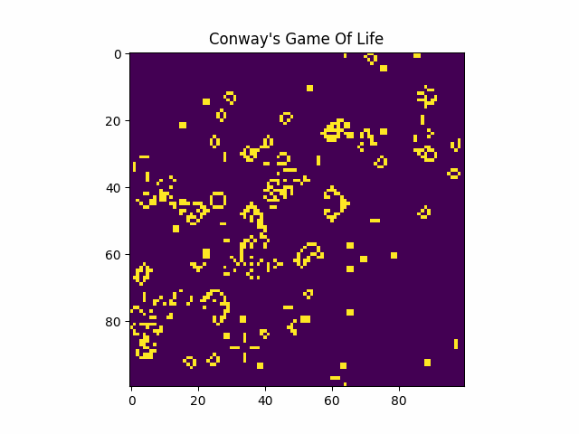

# Conway game of life

Python code to implement Conway's Game Of Life



## Project Structure
```
PROJECT_ROOT
├── imgs/
│   ├──   :
│   └──   :
├── past/
│   ├── conway.py
│   └── pattern.py
├── .gitignore
├── Conway.py
├── generate_gif.py
├── main.py
└── README.md
```

## How to run
```
python3 main.py
```